# Class Diagram

SmartWeights uses an MVVM architecture and the class diagrams reflect as such. The frontend represents the views and the backend represents the viewmodels and models. The following is separated in this manner. Every view has its own respective viewmodel.

## Front End
Our frontend is made with SwiftUI and the visual elements are made through its views. Views come from SwiftUI's View struct. The entry point into the application is through the SmartWeightsApp class. The elements within the views vary, but all are relevant to some graphical component. Some contain buttons, images, or components that we are creating that are not part of the SwiftUI library such as the WorkoutGraph or Calendar. The methods in the views represent any sort of user interaction with the view. The method itself calls to its respective ViewModel to handle the functionality. Many views are made up of the NavBar component and it allows users to view other key components. The NavBar is necessary in creating a simple but effective way for users to traverse the application.

## Backend 
The backend represents the ViewModel and Model portion of the architecture.
The ViewModels's tasks are to handle any type of logic related to the application. Some are simple such as changing which view to redirect to, or update the current view with new data relevant to their reliant variables. The models are the classes that hold the data elements these views rely on.
Additionally, there are classes to connect to external APIs these including: Firebase, SiriKit, AppleHealthKit. These classes establish the connection between the application and API and allow the transfer of data between the two.
There is also an API that connects to our hardware (Raspberry Pi Pico W). This API class establishes the connection and requests data from the PI. The PI has its own classes of data that it is sending to the application.

## Connected

### App
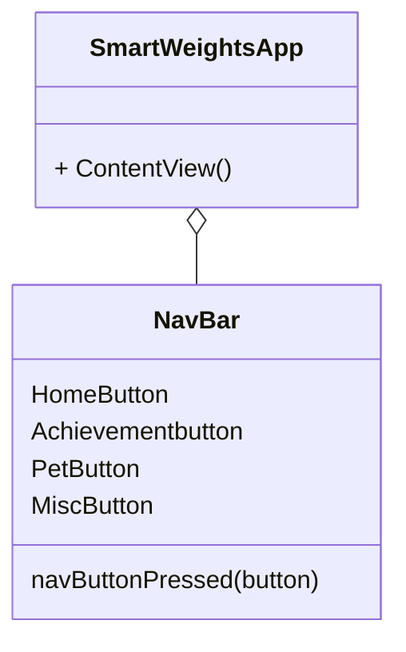
### Login
Text about login
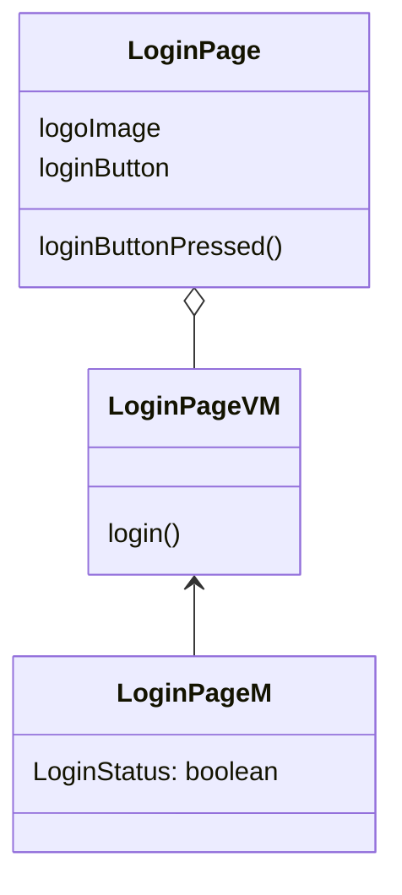

### Virtual Pet
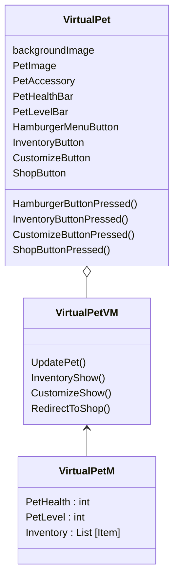

### Challenges
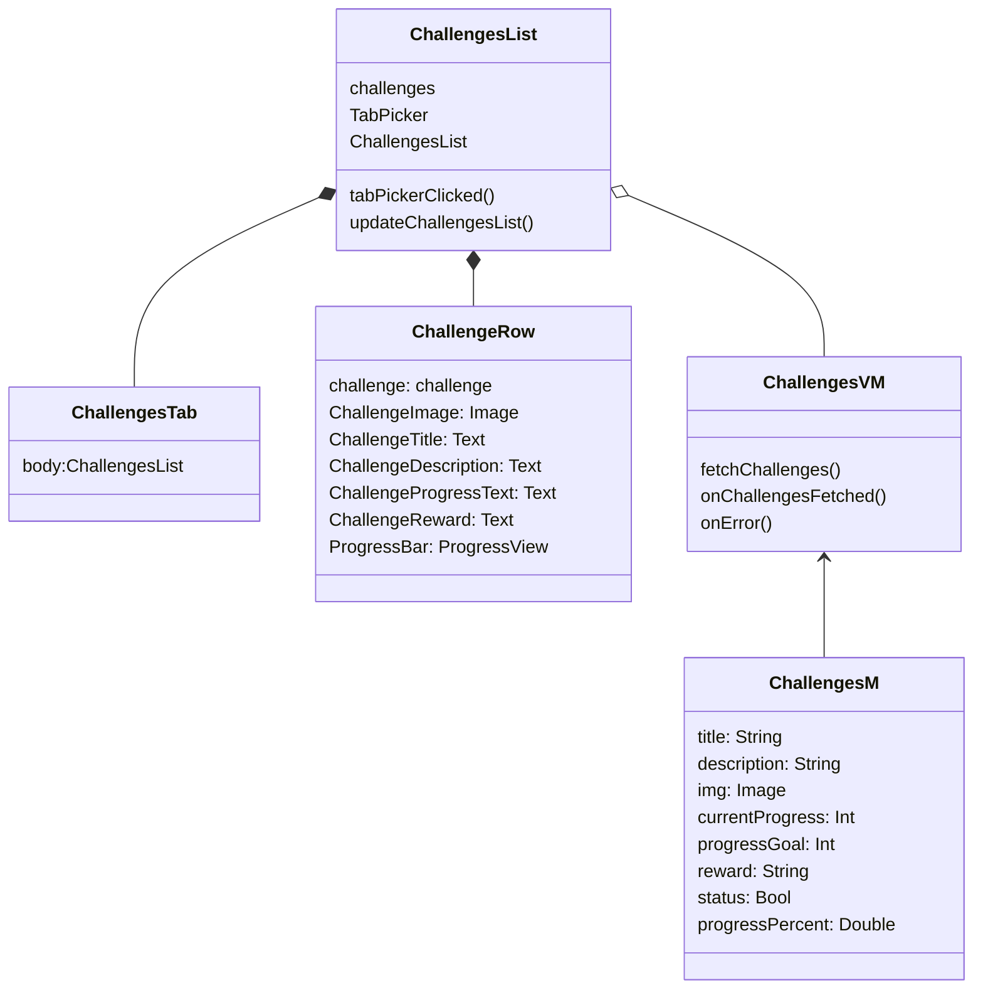

### Pet Store
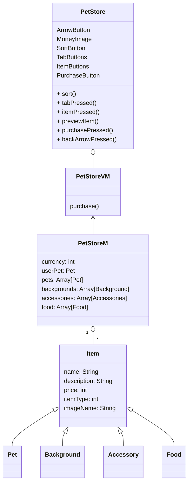

### Profile
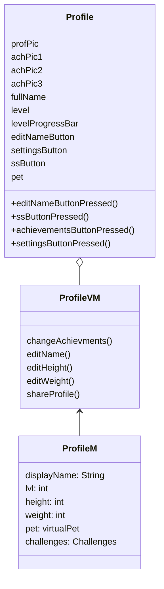

### Settings
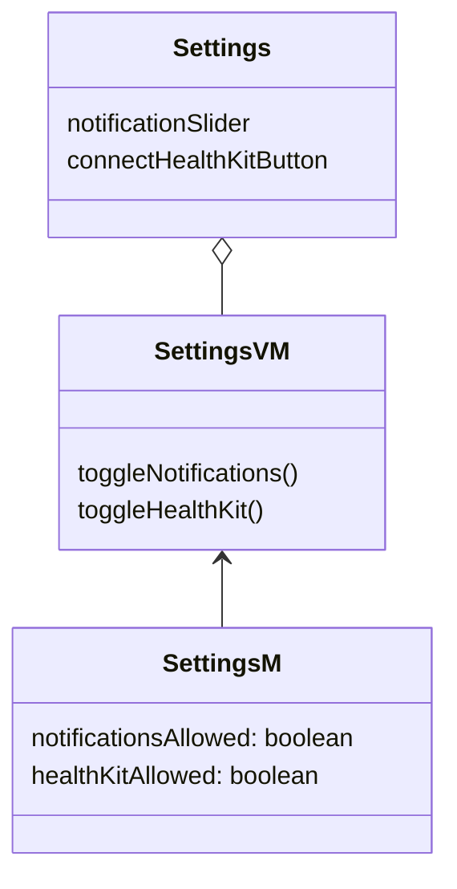

### HomePage

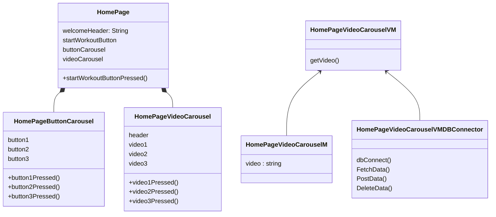

### Workout
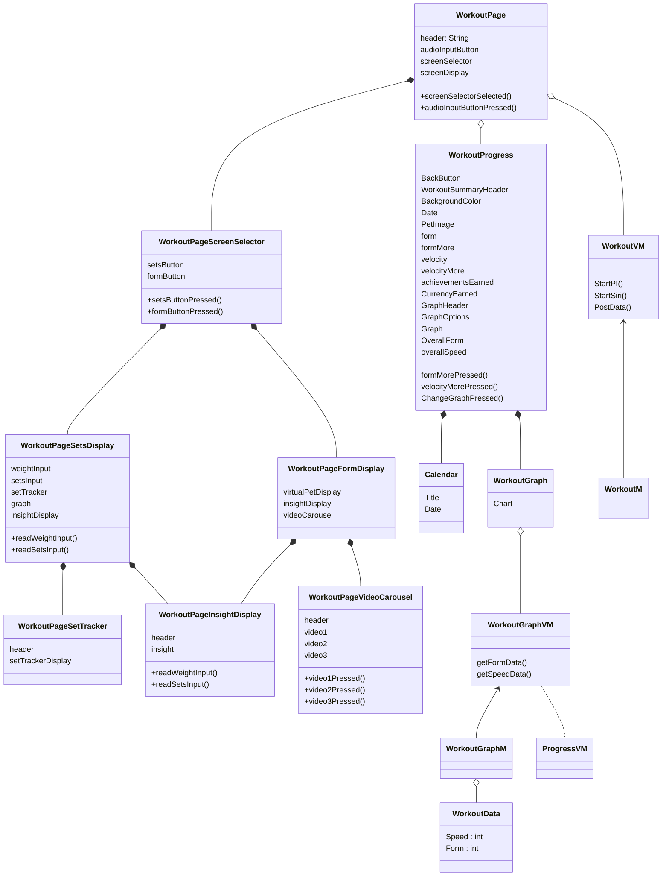

## External Logic

### DB Management

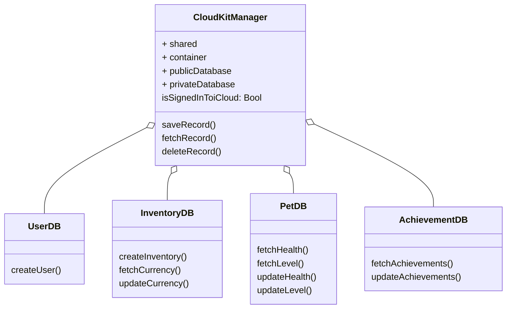

#### Example Implementation
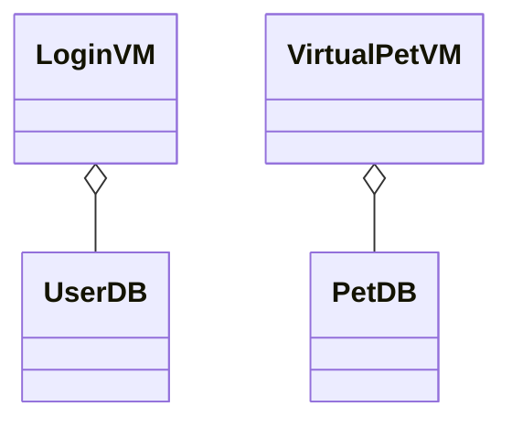

### Bluetooth Low Energy Connector
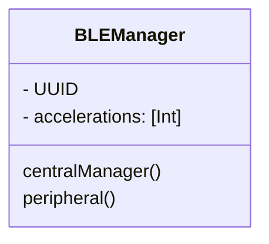
#### Example Implementation
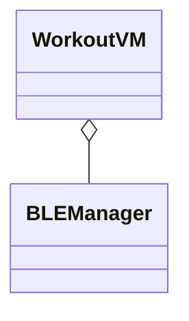

## Raspberry Pi Pico W

MPU class is a driver https://github.com/micropython-IMU/micropython-mpu9150.git 
class vector3D is for imu inertial measurement unit drivers Authors Peter Hinch, Sebastian Plamauer

IDK Which class is being used
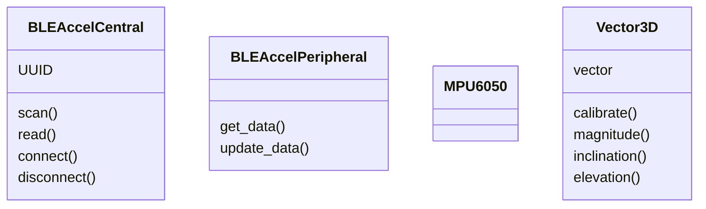