# Class Diagram

SmartWeights uses an MVVM architecture and the class diagrams reflect as such. The frontend represents the views and the backend represents the viewmodels and models. The following is separated in this manner. Every view has its own respective viewmodel.

## Frontend

Our frontend is made with SwiftUI and the visual elements are made through its views. Views come from SwiftUI's View struct. The entry point into the application is through the SmartWeightsApp class.

## Backend

```mermaid 
---
title: Backend
---

classDiagram 
    class LoginPageVM{
        login()
    }
    class LoginPageM{
        LoginStatus: boolean
    }
    class NavBarVM{
        viewChange()
    }
    class VirtualPetVM{
        UpdatePet()
        InventoryShow()
        CustomizeShow()
        RedirectToShop()
    }
    class VirtualPetM{
        PetHealth : int
        PetLevel : int 
        Inventory : List [Item]
    }
    class ChallengesVM{
        fetchChallenges()
        onChallengesFetched()
        onError()
    }
    class ChallengesM{
        title: String
        description: String
        img: Image
        currentProgress: Int
        progressGoal: Int
        reward: String
        status: Bool
        progressPercent: Double
    }
    class ProfileVM{
        changeAchievments()
        editName()
        editHeight()
        editWeight()
        shareProfile()
    }
    class ProfileM{
        displayName: String
        lvl: int
        height: int
        weight: int
        pet: virtualPet
        challenges: Challenges

    }
    class PetStoreVM{
        purchase()
    }
    class PetStoreM{
        currency: int
        userPet: Pet
        pets: Array[Pet]
        backgrounds: Array[Background]
        accessories: Array[Accessories]
        food: Array[Food]   
    }
    class Item{
        name: String
        description: String
        price: int
        itemType: int
        imageName: String
    }
    class Pet{

    }
    class Background{

    }
    class Accessory{

    }
    class Food{

    }
    class ProgressVM{
        getForm()
        getVelocity()
        getAchievementsEarned()
        getCurrencyEarned()
        getFeedback()
    }
    class ProgressM{
        form:int
        velocity:int
        achievementsEarned:int
        currencyEarned:int
    }

    class CalendarVM{
        updateDate()
    }
    class CalendarM{
        SelectedDate
    }
    class WorkoutVM{
        StartPI()
        StartSiri()
        PostData()
    }
    class WorkoutM{

    }
    class SettingsVM{
        toggleNotifications()
        toggleHealthKit()
    }
    class SettingsM{
        notificationsAllowed: boolean
        healthKitAllowed: boolean
    }
    class HomePageButtonCarouselVM{
        redirect(view)
    }
    class WorkoutGraphVM{
        getFormData()
        getSpeedData()
    }
    class WorkoutGraphM{
        
    }
    class WorkoutData{
        Speed : int
        Form : int
    }
    
    class HomePageVideoCarouselVM{
        getVideo()
    }
    class HomePageVideoCarouselM{
        video : string
    }
    
    class HomePageVideoCarouselVMDBConnector{
        dbConnect()
        FetchData()
        PostData()
        DeleteData()
    }
    %% class APIConnector {
    %%     <<Interface>>
    %%     dbConnect()
    %%     FetchData()
    %%     PostData()
    %%     DeleteData()
    %% }
    class FirebaseAPIConnector{
        FetchData()
        DeleteData()
        PostData()
    }
    class HealthKitConnector{
        FetchData()
        DeleteData()
        PostData()
    }
    class SiriKitConnector{
        FetchData()
        DeleteData()
        PostData()
    }
    class PIAPI{
        connect()
        getData()
    }
    class PI{
        sendData()
    }
    class PIData{
        Position
        Speed
        Angle
        Elevation
    }
    LoginPageVM <-- LoginPageM
    VirtualPetVM <-- VirtualPetM
    VirtualPetM "1" o-- "*" Item
    ChallengesVM <-- ChallengesM
    ProfileVM <-- ProfileM
    ProfileM o-- VirtualPetM
    ChallengesM --o ProfileM
    PetStoreVM <-- PetStoreM
    PetStoreM "1" o-- "*" Item
    WorkoutGraphVM <-- WorkoutGraphM
    WorkoutGraphM o-- WorkoutData
    WorkoutGraphVM .. ProgressVM
    HomePageVideoCarouselVM <-- HomePageVideoCarouselM
    HomePageVideoCarouselVM <-- HomePageVideoCarouselVMDBConnector
    ProgressVM <-- ProgressM
    CalendarVM <-- CalendarM
    Item <|-- Pet
    Item <|-- Background
    Item <|-- Accessory
    Item <|-- Food
    
    SettingsVM <-- SettingsM
    WorkoutVM <-- PIAPI
    WorkoutVM <-- WorkoutM
    WorkoutVM <-- SiriKitConnector
    WorkoutVM <-- FirebaseAPIConnector
    WorkoutM o-- PIData
    WorkoutVM <-- HealthKitConnector 
    PIAPI <-- PI
    PI "1" o-- "*" PIData

   
```

