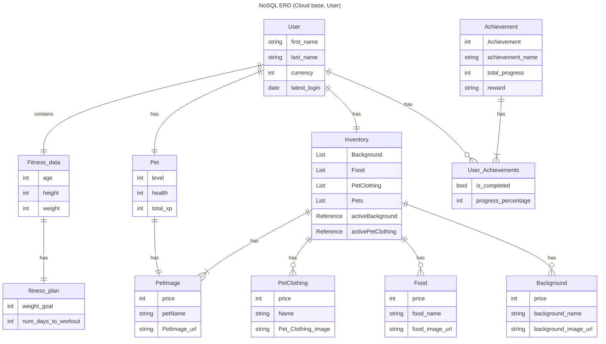
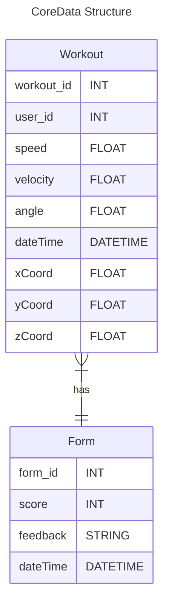

# Database Diagrams

SmartWeights uses a relation schema approach to the database design. It combines usage of both cloud based database (CloudKit) and local storage database (CoreData).

## CloudKit Database Design

CloudKit uses a relational database schema where every record has a relation to an iCloud user record that is created by CloudKit.

The **_User_** entity is meant to store the id that is generated by CloudKit and other relevant data. This is used as the parent for other entities.
CloudKit offers two databases:

- Public
  - Records that are accessible to all users of the application
- Private
  - Records that are only accessible to the specific iCloud user

The portions of the public database are all of the asset related entities. The public database's data is never manipulated by users, only read. These entities being:
- Achievement
- PetImage
- PetClothing
- Food
- Background

The user is able to manipulate data in their "private cloud database." These specific entities being:

- Pet
- Inventory
- FitnessData
- FitnessPlan
- Achievement

The activeBackground and activePetClothing attributes act as references directly to their specific assets. The lists in inventory is an array of references to their specific assets. This is so an inventory can contain multiple of references, such as an inventory containing more than one type of background asset.

## CloudKit Database Design, Shop

The application's shop page retrieves the images from the database, stores, and displays them. The user does not manipulate this relevant data. It is used for the application to retrieve assets needed for the shop and to make loading assets with relevant values easier for development. 

## CoreData Database Design

The purpose of the CoreData database design is to be lightweight and to contain the information that will be received from the multiple sensors attached to the user and dumbbells. This will help provide relevant feedback for the user's workout once the data has been processed through an algorithm. There will also be a history with each feedback to allow users to revisit and see their past feedback.

There will be a form with as many workouts depending on how many sets the user is doing. The form will take all the data from several Workouts and process it through an algorithm to detect whether or not the user had good or bad form through a scoring system ( 1 to 100, 1 being worst to 100 being perfect). There will also be feedback correlated with the score and will consist of suggestions on how to fix up their form.

