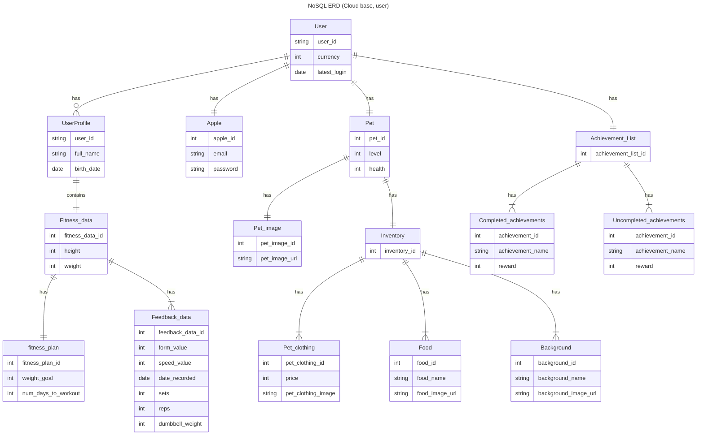

# Database Diagrams

```mermaid
---
title: NoSQL ERD (Cloud base, user)
---
erDiagram 
    User ||--o{ UserProfile : has
    User ||--|| Apple : has
    User ||--||Achievement_List: has
    UserProfile ||--||Fitness_data: contains
    User ||--||Pet:has
    Pet ||--|| Pet_image: has 
    Inventory ||--|{ Pet_clothing: has 
    Pet ||--||Inventory: has
    Inventory ||--|{ Food: has 
    Inventory ||--|{ Background: has 
    %% Shop ||--|{ Pet: has
    %% Shop ||--|{ Pet_clothing: has
    Fitness_data||--||fitness_plan: has 
    Fitness_data||--|{Feedback_data:has
    Achievement_List||--|{ Completed_achievements: has
    Achievement_List||--|{ Uncompleted_achievements: has
    UserProfile {
        string user_id
        string full_name
        date birth_date
    }
    Fitness_data{
        int fitness_data_id
        int height
        int weight 
     
    }
    Feedback_data{
        int feedback_data_id
        int form_value
        int speed_value
        date date_recorded
        int sets
        int reps
        int dumbbell_weight
    }
    fitness_plan{
        int fitness_plan_id
        int weight_goal
        int num_days_to_workout
    }
    User {
        string user_id
        int currency
        date latest_login
        %% string apple_id
        %% enum account_type
        %% date registration_date
    }
    Apple{
        int apple_id
        string email
        string password
    }
    %% Account_type{
    %%     int account_type_id
    %%     string account_type 
    %% }
    Pet{
        int pet_id
        int level
        int health
    }
    Pet_image{
        int pet_image_id
        string pet_image_url
    }
    Inventory{
        int inventory_id
    }
    Food{
        int food_id
        string food_name
        string food_image_url
    }
    Background{
        int background_id
        string background_name
        string background_image_url
    }
    Pet_clothing{
        int pet_clothing_id
        int price 
        string pet_clothing_image
    }
    %% Shop{

    %% }
    Achievement_List{
        int achievement_list_id

    }
    Completed_achievements{
        int achievement_id
        string achievement_name
        int reward
    }
    Uncompleted_achievements{
        int achievement_id
        string achievement_name
        int reward
    }
```

