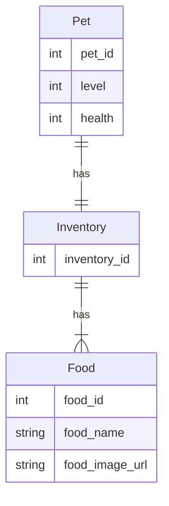
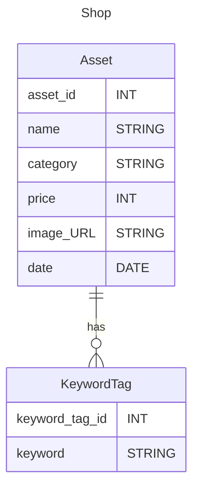
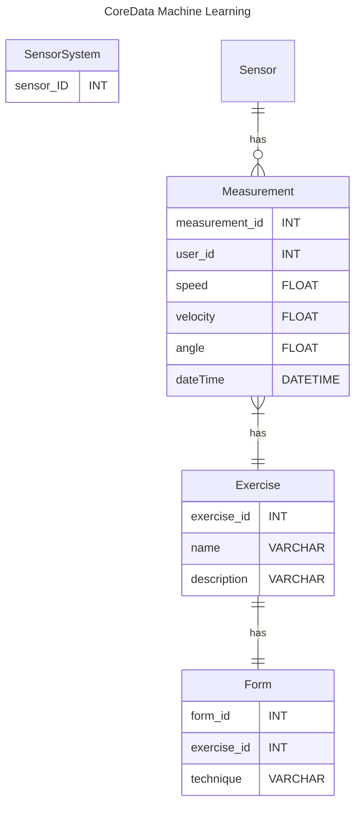

# Database Diagrams
SmartWeights uses a NoSQL approach to the database design. It combines usage of both cloud based database (Firebase) and local storage database (CoreData). 

## Firebase Database Design, User 
This section of the database shows the data the user themselves have and can manipulate. This is somewhat representative of a "snowflake schema". It represents data relevant to the user's:
- Profile
- Achievements
- Pet
- Fitness Data

As this is a NoSQL approach, there are some relations to where there are a one-to-many. This can be seen through something such as inventory. A user has one pet, which has one inventory, but an inventory can store multiple Food. 

## Firebase Database Design, Shop

This is a small section of the database. It is representative of the shop part of the application. The user does not manipulate this relevant data. It is used for the application to retrieve assets needed for the shop and to make loading assets with relevant values easier for development. The shop contains multiple *Assets* and assets can contain 0 or more KeywordTags to help for easier searching functionality in the application.

## CoreData Database Design

The purpose of the CoreData database design is to be lightweight and to contain the information relevant to the machine learning that will take place to help provide relevant feedback for the user's workout. There are multiple sensor systems that will get measurement data.

