# Sequence Diagrams
### Use Case 1 - Account Login
A user wants to login into their account.

1. The user is presented with the login page.
2. The user clicks the 'Login with Apple Account' button.
3. The user enters their account info.
4. The server verified the account.
5. The user is able to continue into the app.

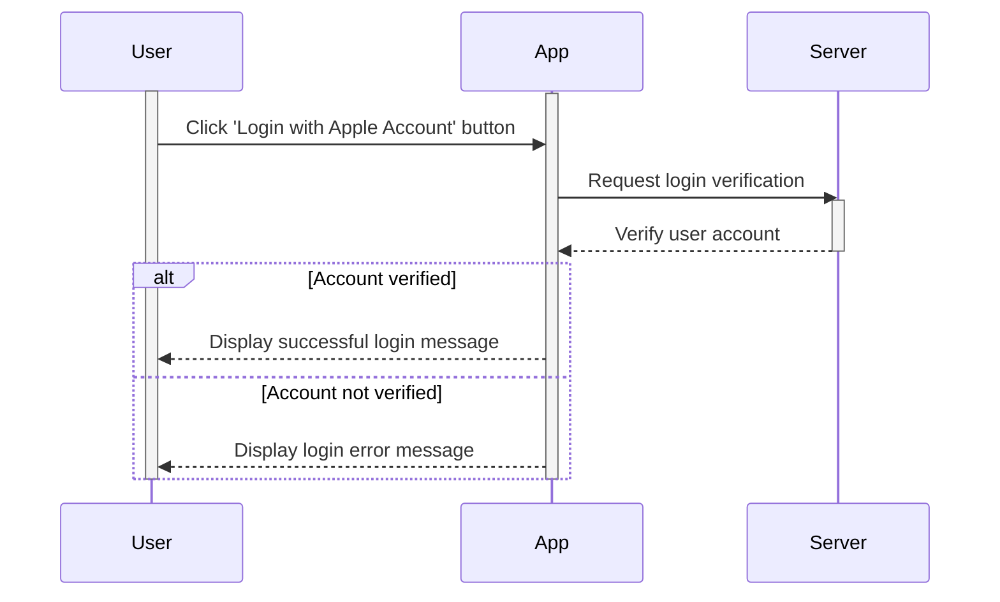

### Use Case 2 - Tutorial and Pet Selection
A user has successfully logged in for the first time.

1. The user logs into their SmartWeights account for the first time.
2. The app displays a generic virtual pet that will guide the user through the application.
3. The virtual pet highlights key features of the application.
4. The user finishes the tutorial.
5. The user is prompted to select their first virtual pet.
6. The user finishes the virtual pet selection process and is returned to the main navigation screen.

### Use Case 3 - Profile Management
A user wants to change their profile settings and workout goals.

1. The user selects the Profile tab.
2. From there, the user can see all their settings and workout goals.
3. The user selects the pencil icon next to the setting.
4. The user edits the desired setting.

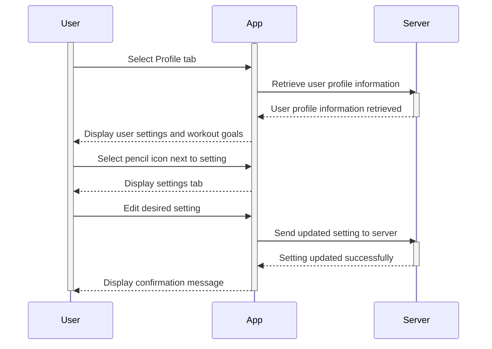

### Use Case 4 - Connecting Sensors
A user wants to connect their SmartWeights sensors with the mobile app.

1. The user securely attaches the SmartWeight sensor to their dumbbell following the instructions provided via the mobile app.
2. The user turns on all the sensors.
3. Upon navigating the to workout page, the app will ask the user to allow bluetooth.
4. After enabling bluetooth, the app will automatically connect to the sensors. 
5. The user will be notified that the sensors are connected.

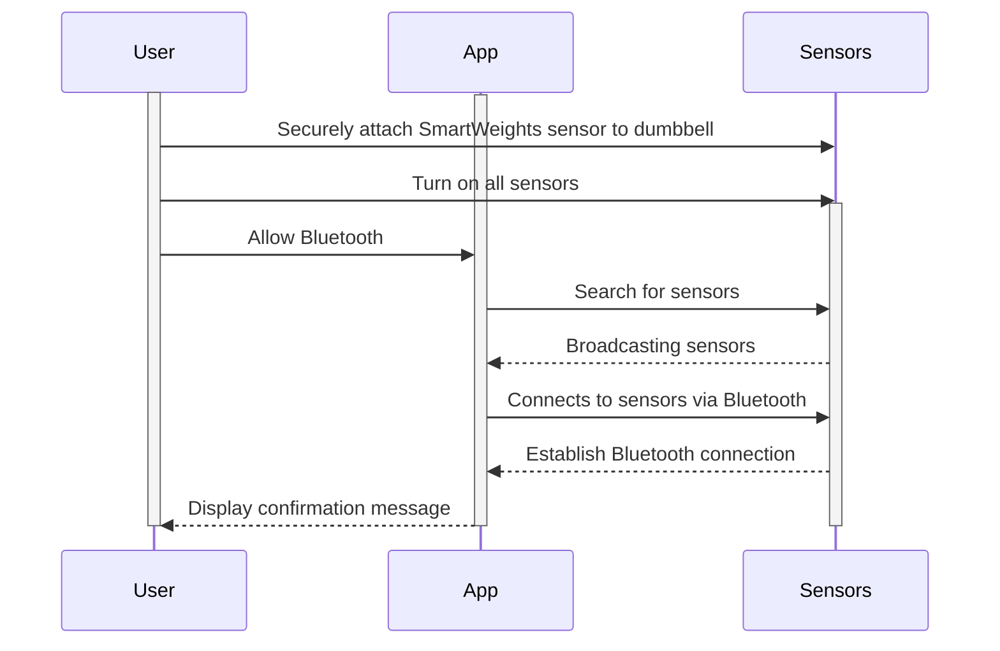

### Use Case 5 - Logging Dumbbell Weight
User wants to log the weights of dumbbells used during a workout for tracking progress over time.

1. On the workout page, the user is prompted to enter their dumbbell weight for the workout.
2. The user inputs the dumbbell weight for the workout.
3. The user begins their workout session without further interaction with the app, focusing on their exercise routine.
4. The dumbbell weight gets logged into their workout history. 

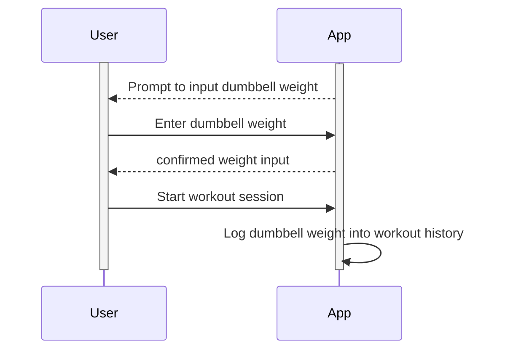
### Use Case 6 - Starting a Workout via voice command
User wants to start a workout session without manually interacting with their smartphone, using a voice command through SmartWeights while already in position to lift weights.
1. The user clicks the microphone button to have SmartWeights listen to voice commands.
2. The user, in position to start lifting and without the need to interact with the device manually, says, “Start workout”.
3. The app processes the command and initiate the workout session.
4. The SmartWeights app activates the workout mode, starts recording the session, including the detection of lifting form, and other relevant data using the attached sensors.

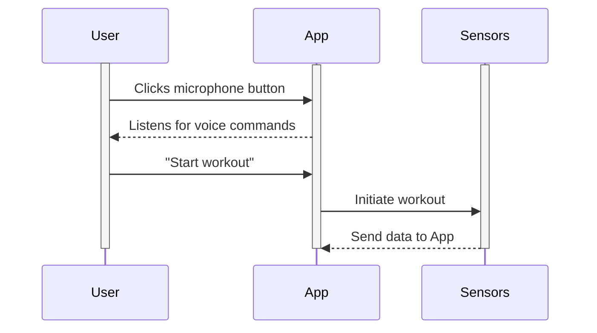

### Use Case 7 - Performing Workout
A user wants to complete a workout with the assistance of the virtual pet. 

1. The user navigates to the workout page.
2. The user finishes their workout set and looks for the virtual pet to give feedback.
3. The virtual pet notifies the user if their form is incorrect.
4. Once finished, the user ends the workout and the SmartWeights application generates a personalized report and summary of the workout for the user. 

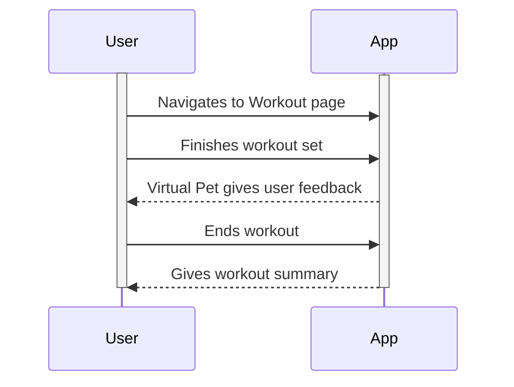

### Use Case 8 - View Workout Feedback History
A user wants to view their workout history.

1. After completing a workout, the user selects the Workout Feedback History button in the mobile application.
2. Once in, the user selects the date to receive workout feedback for that day.
3. From this page, The user will then be able to view feedback on their form and data related to that day. 

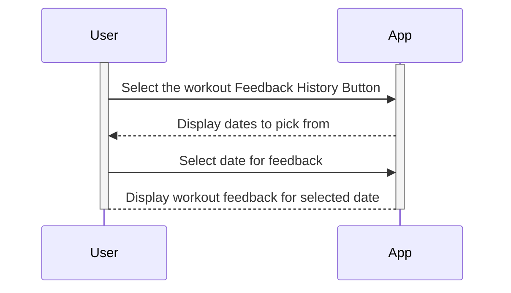
### Use Case 9 - Purchasing Pet Cosmetics
A user wants to purchase cosmetics for their virtual pet.

1. The user navigates to the virtual pet store.
2. The app displays cosmetics by category for the user to inspect.
3. The user sees each cosmetic’s price and clicks the buy button on the desired cosmetic.
4. The user has enough currency for the transaction, so the cosmetic is removed from the store and placed into the user’s virtual pet inventory.
5. The price of the cosmetic is deducted from the user’s total currency.

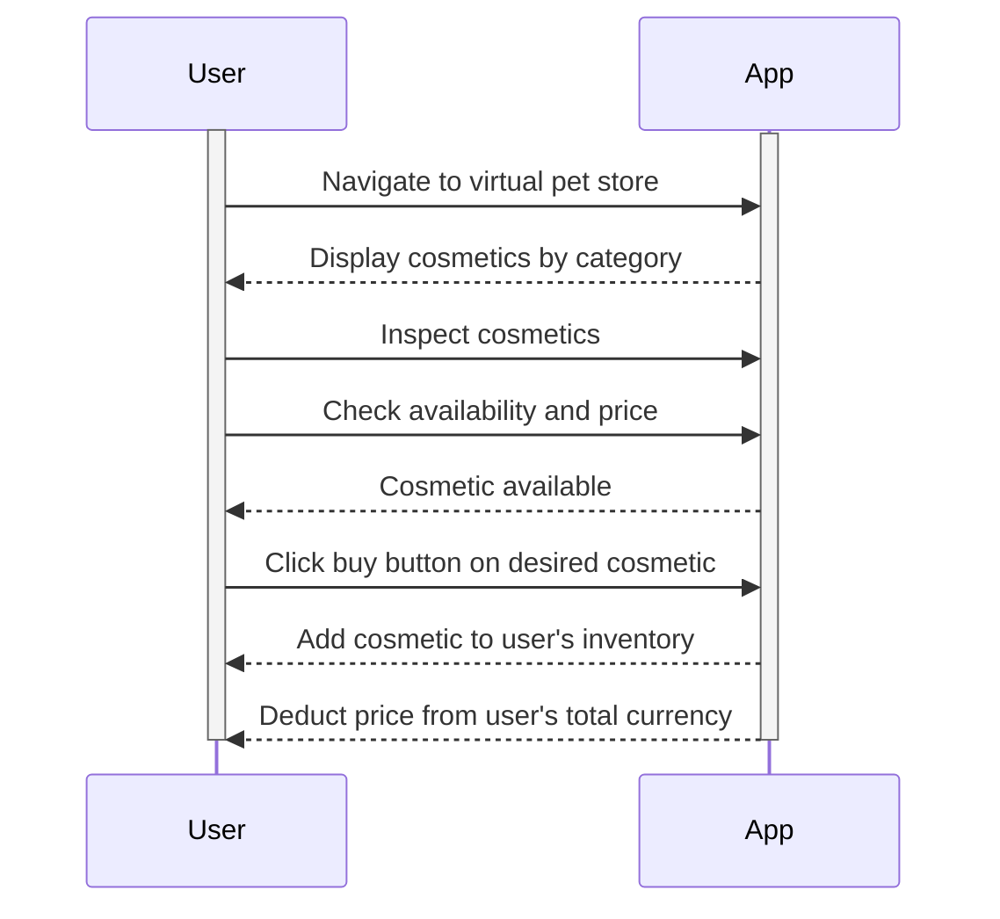

### Use Case 10: - Virtual Pet Customization
A user wants to customize their virtual pet.

1. The user taps on the Virtual Pet button.
2. The user can tap an inventory button to look at what they currently have equipped/own.
3. The user will then select any costume/accessory they want to equip for their pet.
4. The user will see their pet change according to the costumes/accessories they picked.

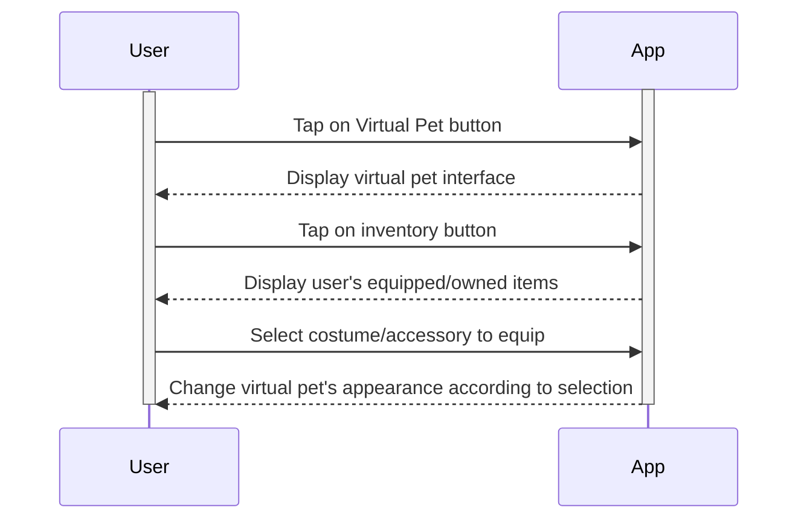

### Use Case 11 - Participating in Weekly Challenge
The SmartWeight app introduces a weekly challenge feature to engage users in varied fitness activities, encouraging consistency and community interaction.

1. The user navigates to the challenges section within the app and opts into the weekly challenge.
2. Once opted in, the user can view detailed information about the challenge, which includes details of the challenge (e.g. total weight lifted, number of workouts completed) and potential reward (e.g. digital currency, virtual pet accessories).
3. Throughout the week, the user engages in their regular workouts, with the app automatically tracking their progress toward the challenge goals using the integrated sensors.
4. The user can check their current standings in the challenge via the app(challenge tab), which updates in real time, showing their progress.
5. At the end of the week, the app notifies the user of the challenge outcome. If they have met the challenge criteria, they receive their reward.

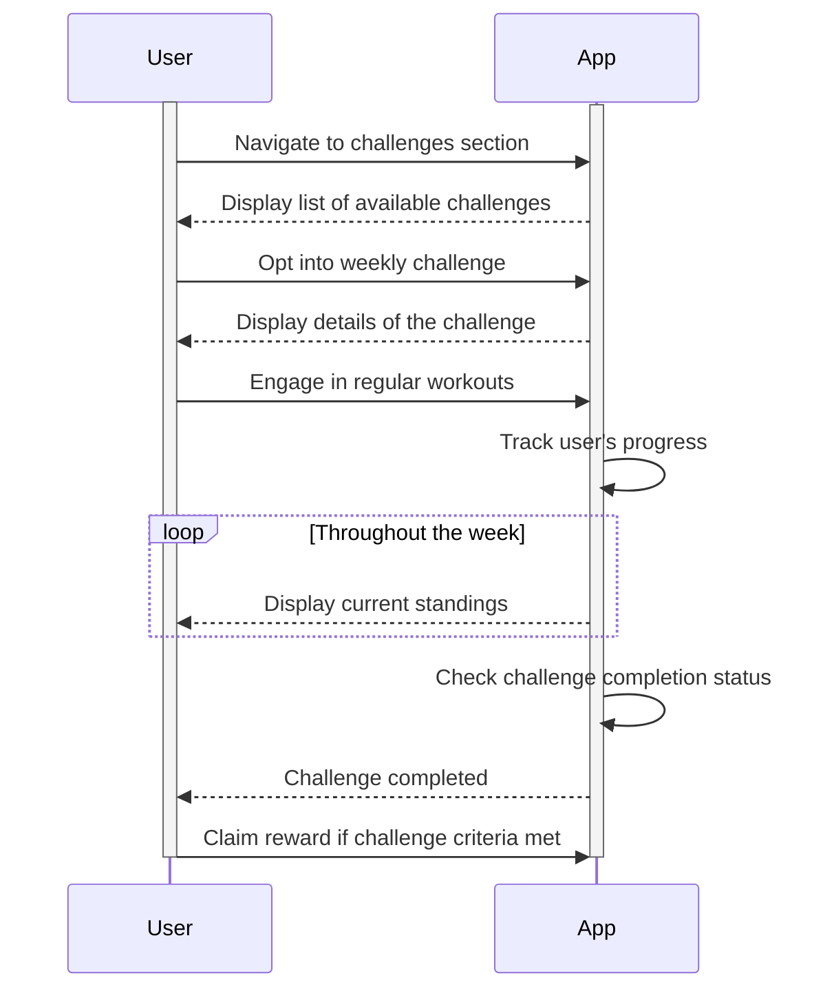

### Use Case 12 - Share with Friends
A user wants to share their pet/achievements with their friends.

1. The user selects the Profile tab.
2. Within the Profile screen, the user will select the Share Profile button.
3. A jpeg of their profile will appear on the screen.
4. User selects who/how they want to share.
5. Profile is sent.

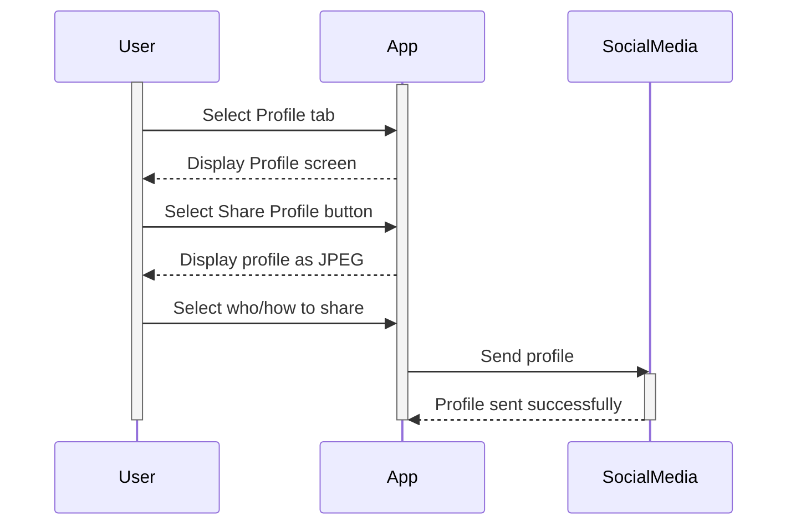