# Sequence Diagrams
### Use Case 1 - Account Login
A user wants to login into their account

1. The user is presented with the login page.
2. The user clicks the 'Login with Apple Account' button.
3. The user enters their account info.
4. The server verified the account.
5. The user is able to continue into the app.

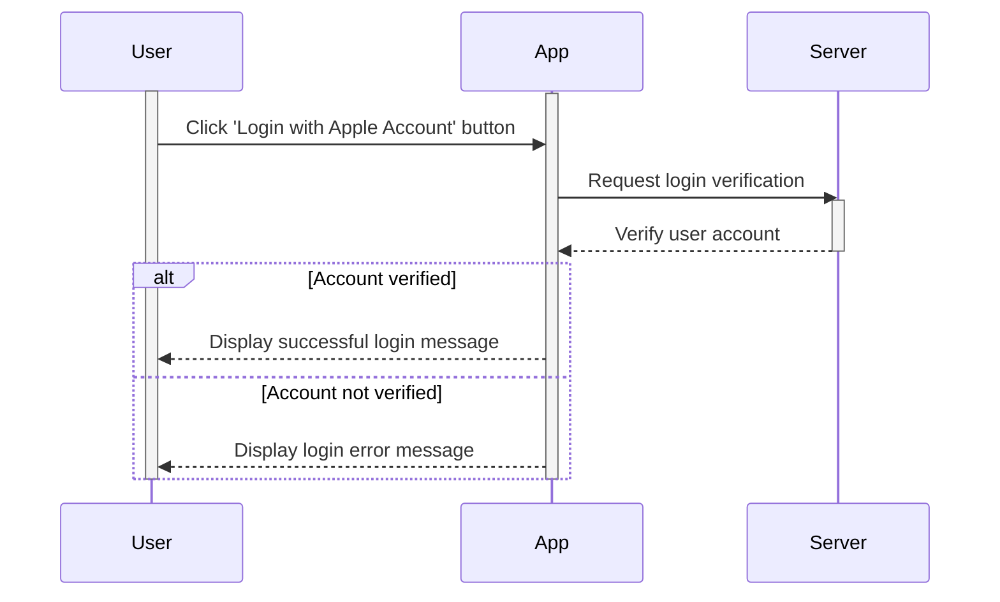

### Use Case 2 - Tutorial
A user has already created a SmartWeights account and has logged in for the first time.

1. The user logs into their SmartWeights account for the first time.
2. The app displays a generic virtual pet that will guide the user through the application.
3. The virtual pet highlights key features of the application.
4. The user finishes the tutorial.
5. The user is prompted to create their own virtual pet.
6. The user finishes the virtual pet creation process and is returned to the main navigation screen.

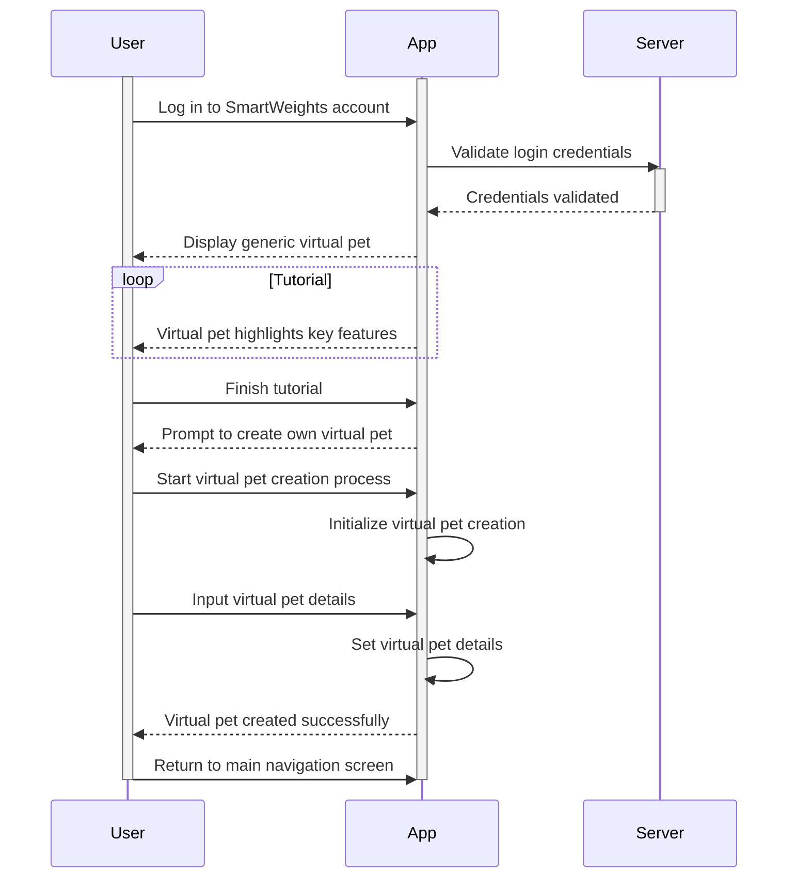

### Use Case 3 - Profile Management
A user wants to change their profile settings and workout goals.

1. The user selects the Profile tab.
2. From there, the user can see all their settings and workout goals.
3. The user selects the pencil icon next to the setting.
4. The user edits the desired setting.

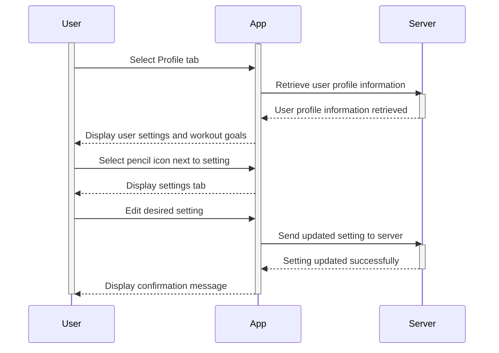

### Use Case 4 - Importing Data From Apple Health to SmartWeight App
User decides to integrate their SmartWeight app with Apple Health to import fitness and health data for a comprehensive overview of their wellness journey.

1. User navigates to the settings.
2. User selects the option to link the SmartWeight app with Apple Health.
3. iOS will prompt the user to authorize access to the required data from Apple Health.
4. User grants permission for the SmartWeight app to access the specified data from Apple Health.
5. iOS automatically begins importing the user’s health and fitness data from Apple Health into the SmartWeight app.

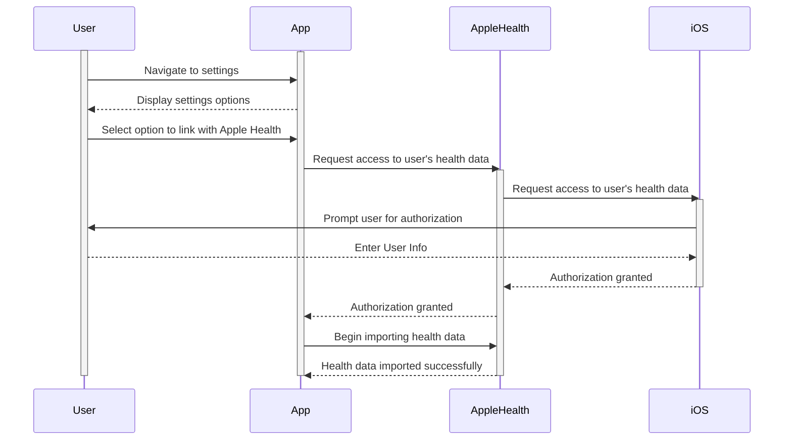

### Use Case 5 - Attaching Sensors 
A user wants to prepare for a workout by attaching sensors appropriately.

1. The user gets the dumbbells and elbow sleeve they want to use.
2. The user attaches the sensors to the heads of the dumbbell, locking it in securely.
3. The user puts on the elbow sleeve.
4. The user attaches the sensor to the elbow sleeve.
5. The user attaches another sensor to their chest.

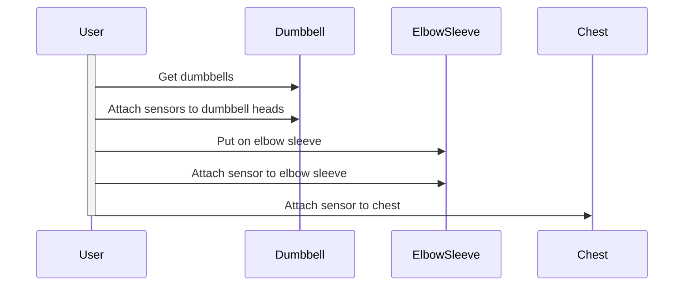
### Use Case 6 - Syncing Sensors
A user wants to sync their SmartWeights sensor with the mobile app.

1. The user securely attaches the SmartWeight sensor to their dumbbell following the instructions provided via the mobile app.
2. The user navigates to the Devices section on the app to initiate the addition of a new sensor.
3. Within the app, the user selects the option to Add New Sensor. The app will provide instructions to ensure the sensor is on and in the pairing mode.
4. The app will search for available sensors. The user selects their sensor from the list of available devices to start the pairing process.
5. Once the user selects their sensor, the app establishes a connection via Bluetooth. A confirmation message is displayed to the user indicating that the sensor is successfully synced.

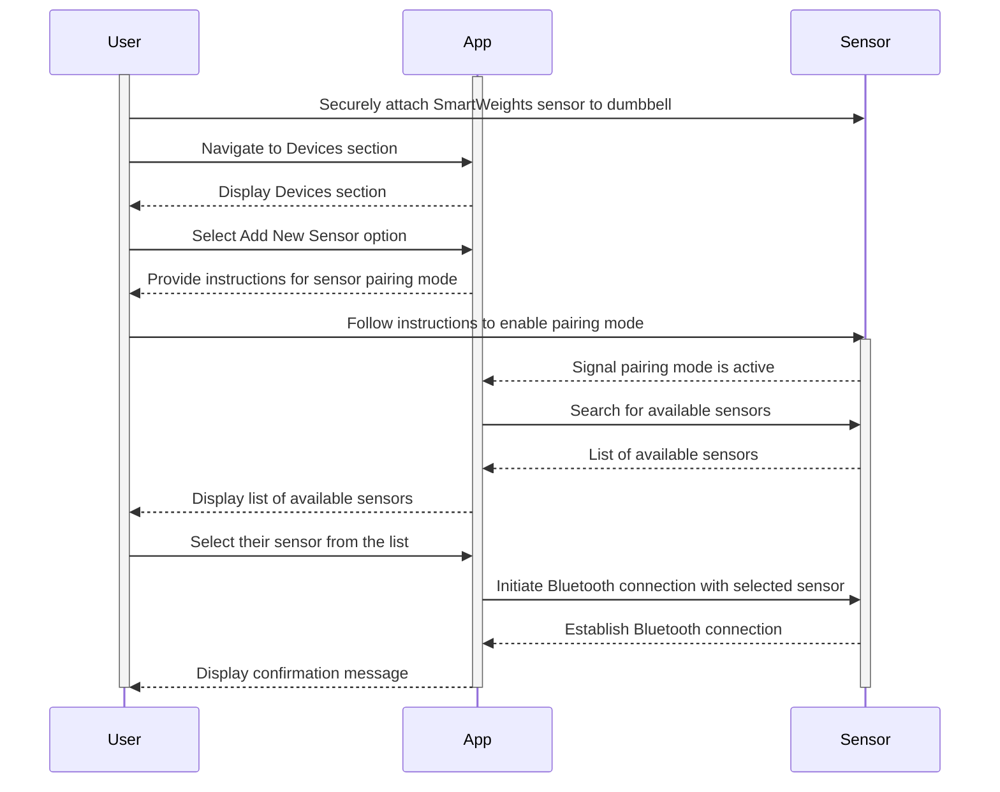

### Use Case 7 - Logging Dumbbell Weight
User wants to log the weights of dumbbells used during a workout for tracking progress over time, independent of immediate feedback on form or technique.

1. After selecting a workout type, the user is prompted to input the weight of the dumbbells they will use.
2. User enters the weights of the dumbbells into the app before starting the workout.
3. The user begins their workout session without further interaction with the app, focusing on their exercise routine.

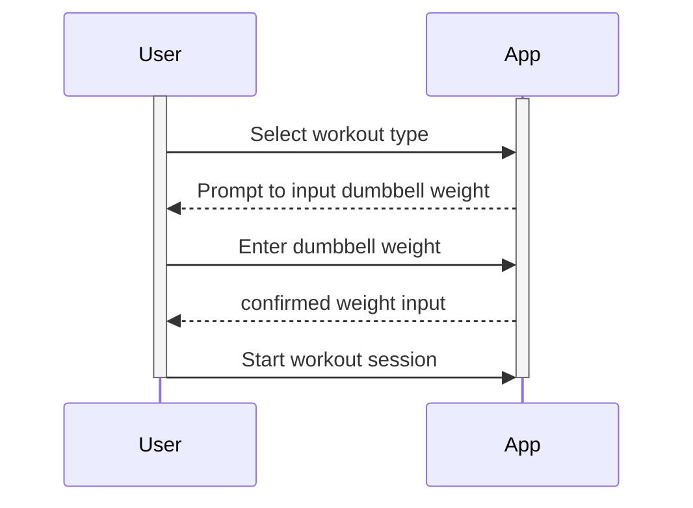
### Use Case 8 - Starting a Workout via Siri Voice Command
User wants to start a workout session without manually interacting with their smartphone, using a voice command through Siri while already in position to lift weights.

1. User, in position to start lifting and without the need to interact with the device manually, says, “Hey Siri, Start my workout”.
2. Siri processes the command and interface with the SmartWeights app to initiate the workout session based on the user's predefined settings or default workout plan.
3. The SmartWeights app activates the workout mode, starts recording the session, including the detection of lifting form, repetitions, and other relevant data using the attached sensors.

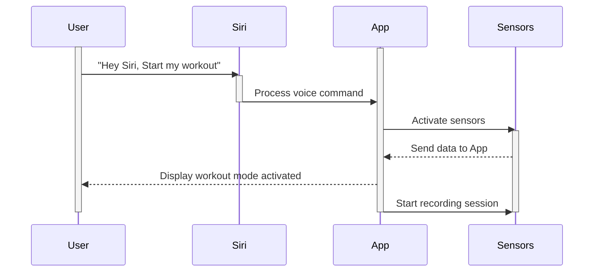

### Use Case 9 - Performing Workout
A user wants to complete a workout with the assistance of the virtual pet. 

1. The user navigates to the workout section.
2. The user completes their repetitions and the SmartWeights application tracks how many reps are completed.
3. The virtual pet notifies the user if their form is incorrect.
4. Once finished, the user ends the workout and the SmartWeights application generates a personalized report and summary of the workout for the user. 

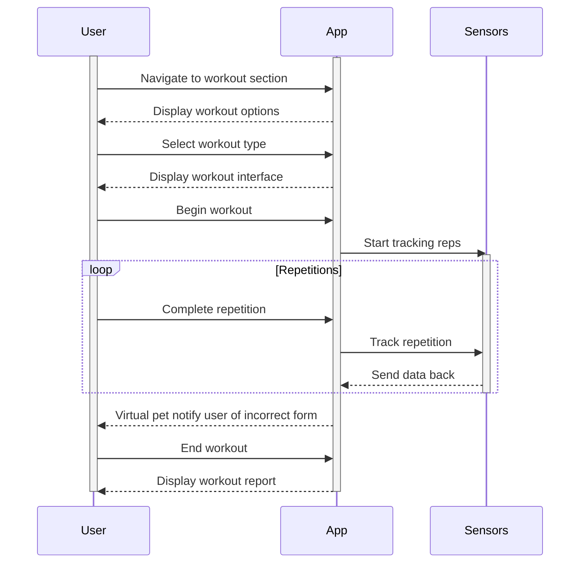

### Use Case 10 - View Workout Feedback
A user wants to view feedback post-workout.

1. After completing a workout, the user selects the post-workout feedback button in the mobile application.
2. Once in, the user selects the date to receive workout feedback for that day.
3. From this page, The user will then be able to view feedback on their form and the number of reps they completed.

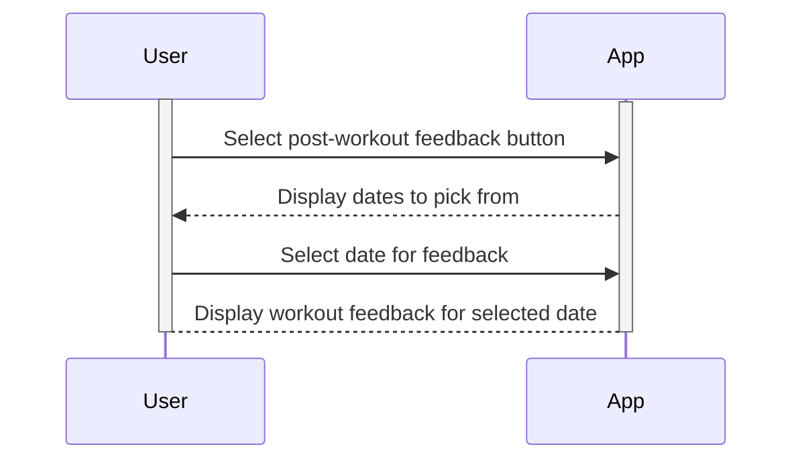
### Use Case 11 - Purchasing Pet Cosmetics
A user wants to purchase cosmetics for their virtual pet.

1. The user navigates to the virtual pet store.
2. The app displays cosmetics by category for the user to inspect.
3. The user sees each cosmetic’s price and clicks the buy button on the desired cosmetic.
4. The user has enough currency for the transaction, so the cosmetic is removed from the store and placed into the user’s virtual pet inventory.
5. The price of the cosmetic is deducted from the user’s total currency.

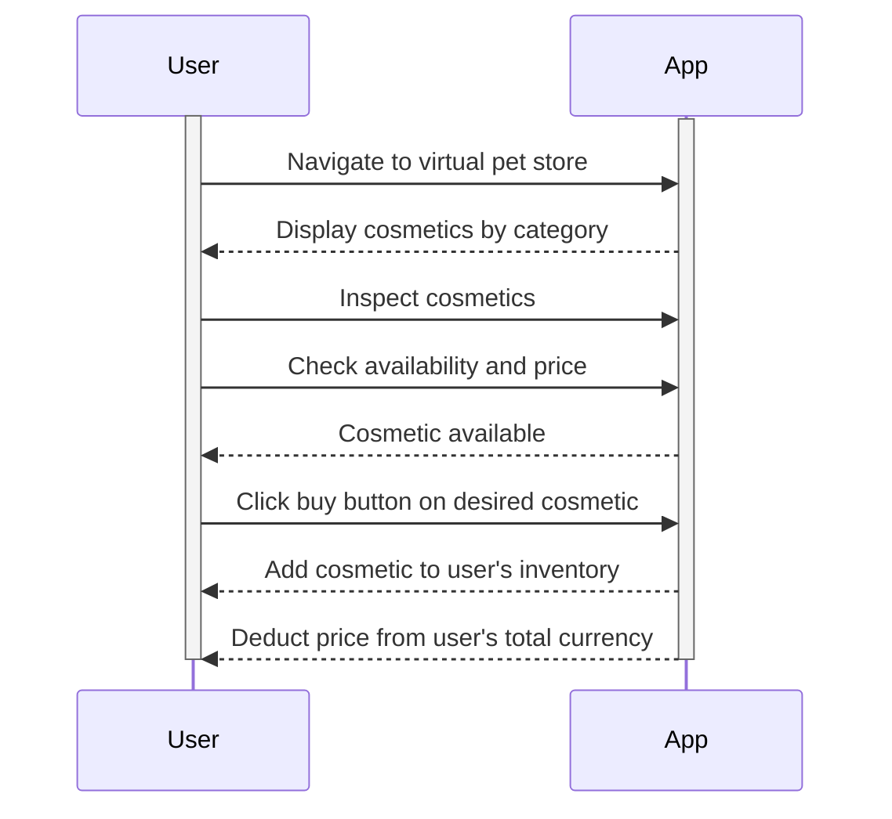

### Use Case 12: - Virtual Pet Customization
A user wants to customize their virtual pet.

1. The user taps on the Virtual Pet button.
2. The user can tap an inventory button to look at what they currently have equipped/own.
3. The user will then select any costume/accessory they want to equip for their pet.
4. The user will see their pet change according to the costumes/accessories they picked.

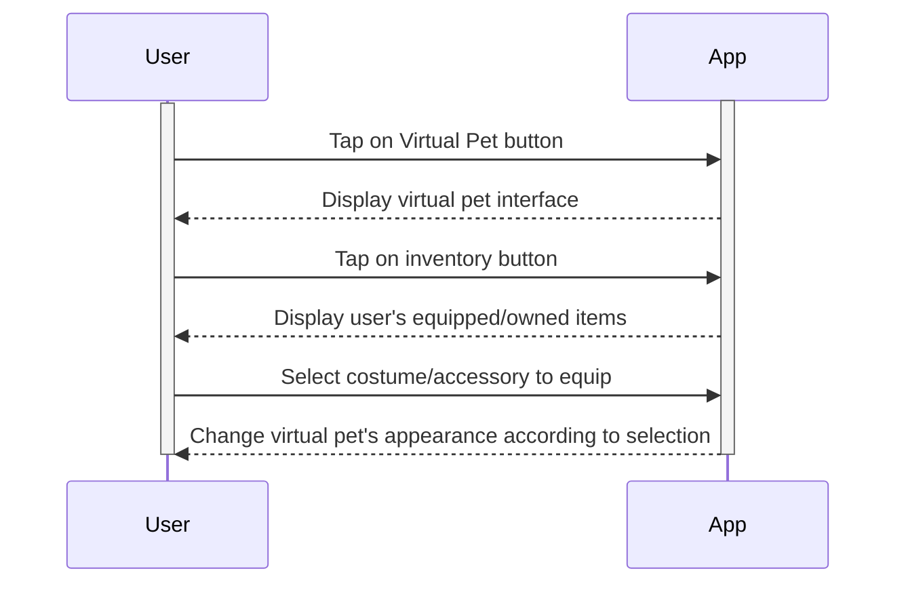

### Use Case 13 - Participating in Weekly Challenge
The SmartWeight app introduces a weekly challenge feature to engage users in varied fitness activities, encouraging consistency and community interaction.

1. The user navigates to the challenges section within the app and opts into the weekly challenge.
2. Once opted in, the user can view detailed information about the challenge, which includes details of the challenge (e.g. total weight lifted, number of workouts completed) and potential reward (e.g. digital currency, virtual pet accessories).
3. Throughout the week, the user engages in their regular workouts, with the app automatically tracking their progress toward the challenge goals using the integrated sensors.
4. The user can check their current standings in the challenge via the app(challenge tab), which updates in real time, showing their progress.
5. At the end of the week, the app notifies the user of the challenge outcome. If they have met the challenge criteria, they receive their reward.

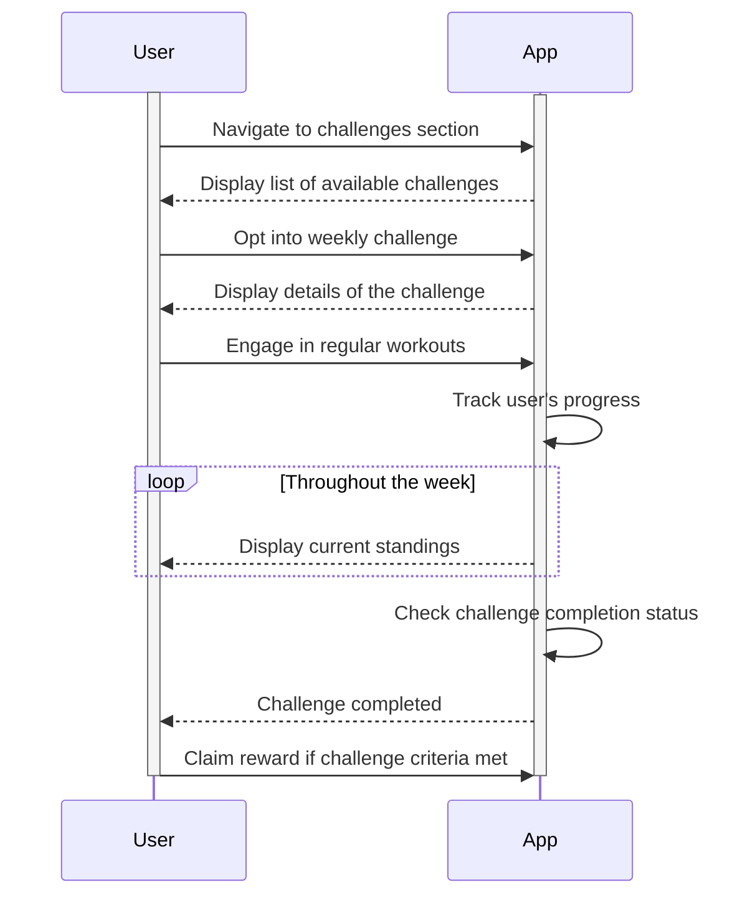

### Use Case 14 - Share with Friends
A user wants to share their pet/achievements with their friends.

1. The user selects the Virtual Pet tab.
2. Within the Virtual Pet screen, the user will select the Share Profile button.
3. A jpeg of their profile will appear on the screen.
4. User selects who/how they want to share.
5. Profile is sent.

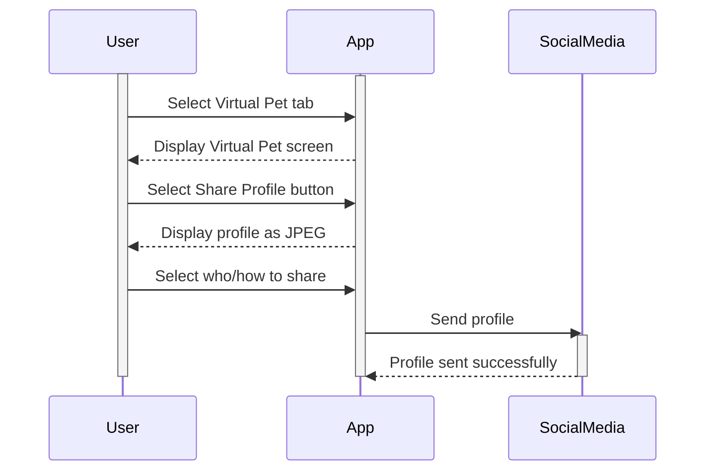