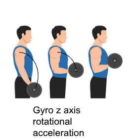
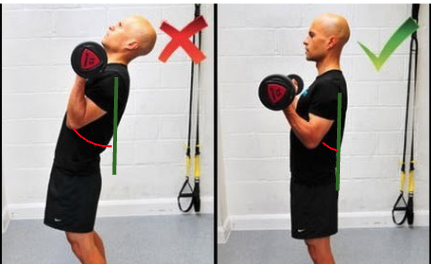

# User Form Table

The two tables below are used to create a threshold of what is considered good form. The numbers represent the acceleration in degrees per second. The MPU6050 sensor is responsible for these providing gyroscopical data. 

`Start Position` - Any degrees per second between ± 10 are not added to the calculation. The range is there to show that the user is holding the dumbbell or their elbow still. This is not a part of the form feedback calculation.

`Doing curl (good), Elbow position (stable)` - data between these parameters means the user is having 'good' form. This data gets used to find the total percentage of how good their form is. `good data`/ `total data collected` = `percentage of good form`

`Doing curl (too fast), Elbow position (moving)` - data outside of the provided range means the user is having 'bad' form.

`Dangerous` - Any data that is above this parameter is considered potentially dangerous to the user. This means if the dumbbell is moving more than 500 degrees per second or the elbow is moving more than 300 degrees per second then the movement is dangerous. 

`Axis` - each axis represents a different movement that can be done with the dumbbell and elbow. The axes are assigned to a specific movement due to the placement of the sesnor. 

| Dumbbell Sensor       | z-axis rotation (up and down)         | x-axis rotation (twisting left and right)   | y-axis rotation (twisting up and down)    |
|-----------------------|----------------------------------|----------------------------------------|---------------------------------------|
| Start position        | between ±10°/s                   | between ±10°/s                        | between ±10°/s                       |
| Doing curl (good)     | between ±200°/s                  | between ±100°/s                       | between ±100°/s                      |
| Doing Curl (too fast) | greater/less than ±200°/s        | greater/less than ±100°/s             | greater/less than ±100°/s             |
| Dangerous             | greater/less than ±500°/s        | greater/less than ±500°/s             | greater/less than ±500°/s             |

| Elbow Sensor          | Swinging back and forth (x-axis)      | Flaring elbow out and up (z-axis)     | Flaring elbow out and forward (y-axis) |
|-----------------------|----------------------------------|----------------------------------------|------------------------------------------|
| Start position        | between ±10°/s                   | between ±10°/s                        | between ±10°/s                          |
| Elbow position (stable) | between ±100°/s                 | between ±100°/s                      | between ±100°/s                         |
| Elbow position (moving) | greater/less than ±100°/s       | greater/less than ±100°/s            | greater/less than ±100°/s               |
| Dangerous             | greater/less than ±300°/s        | greater/less than ±300°/s             | greater/less than ±300°/s               |

 figure 1

Figure 1 shows the movements of the dumbbell. Due to the placement of the sensor, the sensor will use the z-axis to measure the acceleration of the dumbbell in degrees per second. 

 figure 2

Figure 2 shows the movement of the elbow. Due to the placement of the sensor, the sensor will use the x-axis to measure the acceleration of the elbow in degrees per second. 